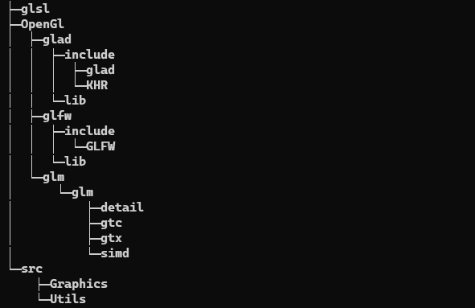

# Opengl 学习
## 开发环境
- VS2019 
- MSVC_x64 
- CMAKE

)

- glsl 目录:

        存放着色器文件
- Opengl目录:
    
        存放opengl 依赖库和头文件 (glad,glfw,glm)
- src 目录：
    
        代码结构

##  目录结构
### 第一节: 
    opengl_rectangle(正方形绘制)
### 第二节: 
    OpenglRectangleTexture(正方形纹理绘制)
